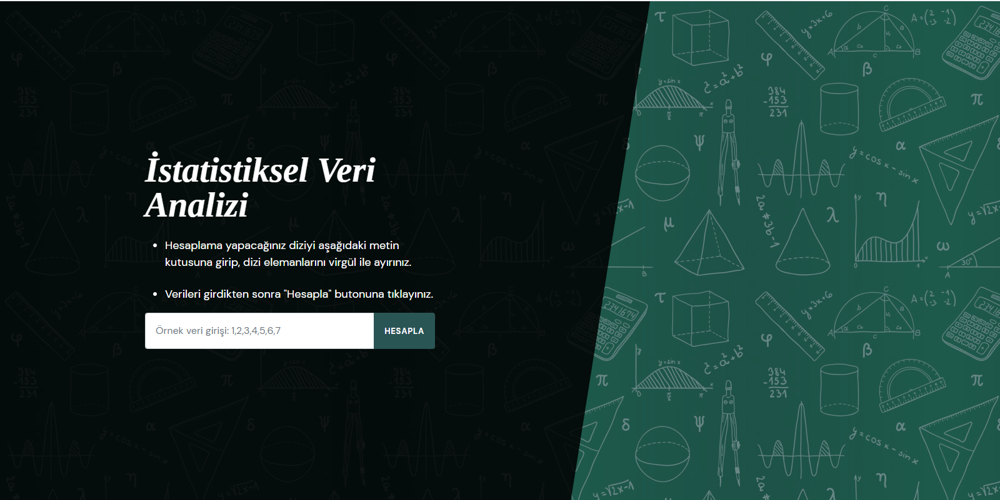
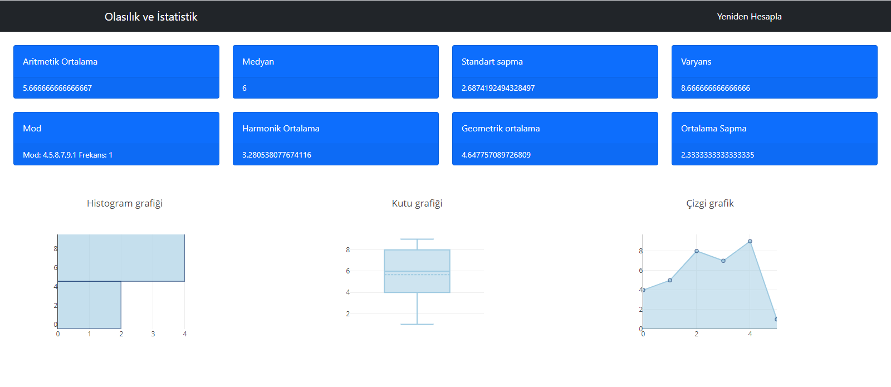

# Olasılık ve İstatistik Dersi Vize-Grup Ödevi

## Siteye buradan ulaşabilirsiniz.
👉 [Site Linki](https://ahmetmert1.github.io/olasilik-istatistik-vize/giris.html) 👈

Bu site sayesinde, siteye veri girişi yapabilirsiniz.
Girişini yaptığınız veri topluluğuyla ilgili;

- Aritmetik Ortalama
- Medyan
- Standart Sapma
- Varyans
- Mod 
- Harmonik Ortalama
- Geometrik Ortalama
- Ortalama sapma

gibi değerlere ulaşabilirsiniz.

# Site içi Görüntüler

Verilerinizin girişini yapacağınız giriş bölümü:

Veri topluluğunuzun değerlerini görebileceğiniz içerik bölümü:

